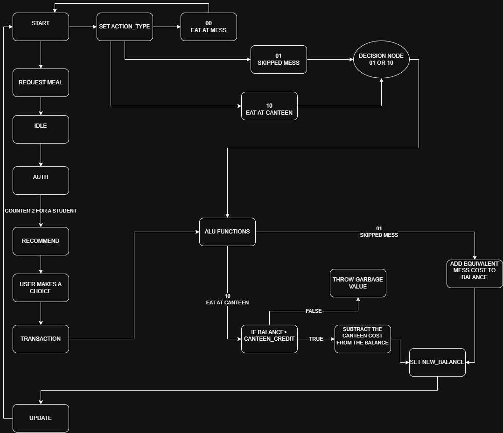
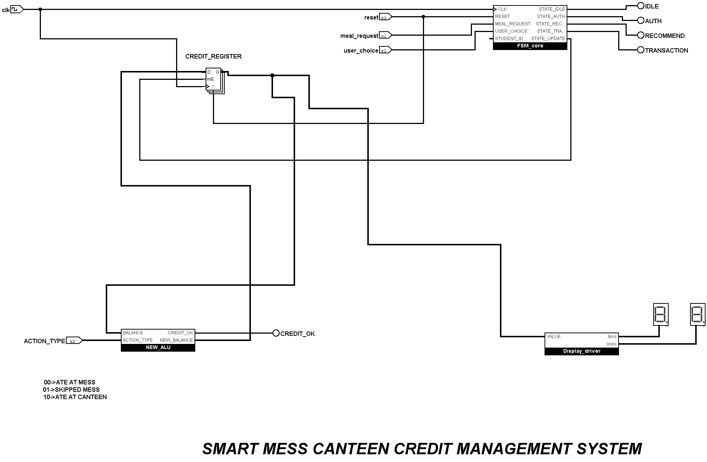
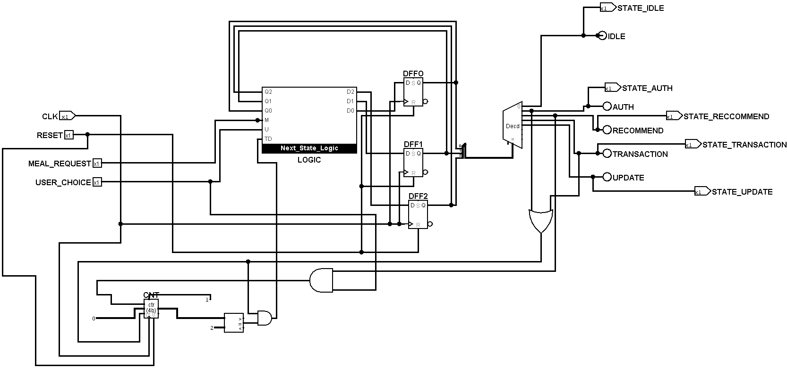
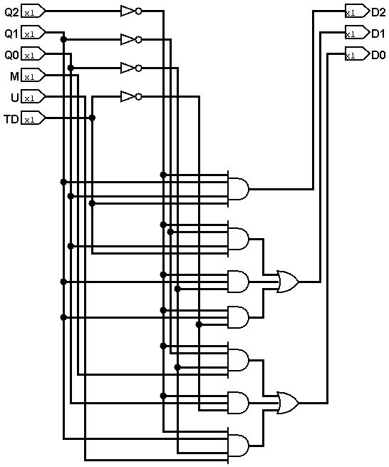
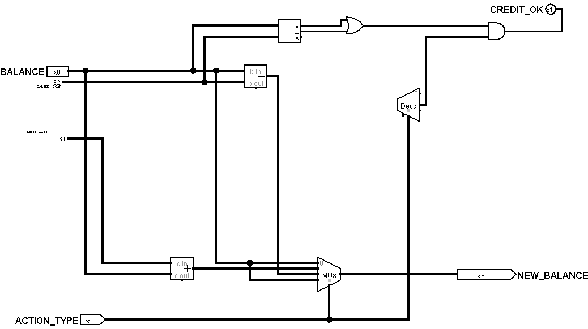
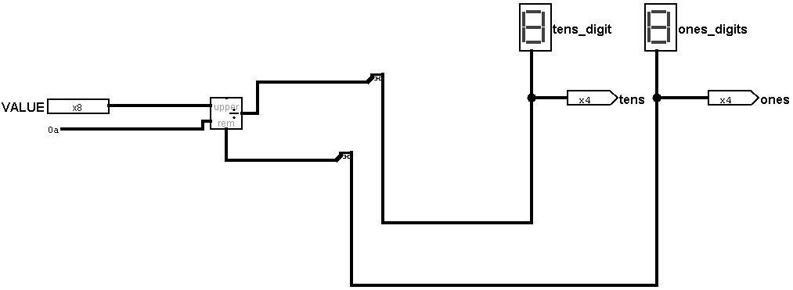

# Intelligent Digital Credit Management System for University Mess/Canteen

<!-- First Section -->
## Team Details
<details>
  <summary>Detail</summary>

  > Semester: 3rd Sem B. Tech. CSE

  > Section: S2

  > Team ID: T18

  > Member-1: Shanthi Alluri, 241CS206, shanthi.alluri@example.com

  > Member-2: Deekshitha Gowda, 241CS224, deekshitha.gowda@example.com

  > Member-3: Somyak Priyadarshi Mohanta, 241CS257, somyak.mohanta@example.com
</details>

<!-- Second Section -->
## Abstract
<details>
  <summary>Detail</summary>
  
  <p><strong>1. Motivation:</strong> Traditional university mess and canteen systems rely on manual or basic digital billing, leading to long queues, credit disputes, and operational inefficiencies. This project addresses these challenges by implementing an automated, intelligent credit management system using digital circuit design principles. By applying our knowledge of Finite State Machines (FSM), Arithmetic Logic Units (ALU), and sequential logic circuits, we create a real-world solution that enhances both student experience and administrative efficiency.</p>

  <p><strong>2. Problem Statement:</strong> This project aims to design and implement a fully automated digital credit management system for university dining facilities using Logisim and Verilog HDL. The system must handle student authentication, flexible credit operations (deductions for meals and additions for refunds), real-time balance validation, and accurate transaction processing. The implementation utilizes only digital components—flip-flops, logic gates, multiplexers, comparators, and adders/subtractors—without relying on microcontrollers or software-based solutions.</p>

  <p><strong>3. Features:</strong></p>
  <ul>
    <li><strong>(a) 5-State FSM Controller:</strong> Implements IDLE, AUTH, RECOMMEND, TRANSACTION, and UPDATE states with minimized next-state logic derived from Karnaugh maps.</li>
    <li><strong>(b) Action-Type Based ALU:</strong> Supports three transaction modes using 2-bit encoding: Ate Mess (00), Skipped Mess (01), and Ate Canteen (10) with configurable add/subtract operations.</li>
    <li><strong>(c) Real-Time Credit Validation:</strong> 8-bit comparator validates sufficient balance for deductions while bypassing checks for refund operations.</li>
    <li><strong>(d) Timer-Based Authentication:</strong> Counter-comparator unit enforces configurable authentication delays to prevent unauthorized access.</li>
    <li><strong>(e) BCD Display Driver:</strong> Converts 8-bit binary balance to dual-digit 7-segment display format for real-time visual feedback.</li>
    <li><strong>(f) Synchronous Design:</strong> All modules operate on a central clock ensuring race-free, atomic transactions.</li>
  </ul>
</details>

<!-- Third Section -->
## Functional Block Diagram
<details>
  <summary>Detail</summary>
  
  <h3>System Flowchart</h3>
  
  
  <h3>Component Architecture</h3>
  <p>The system integrates five principal components:</p>
  <ul>
    <li><strong>FSM Core:</strong> Central controller managing state transitions (IDLE → AUTH → RECOMMEND → TRANSACTION → UPDATE) and generating control signals</li>
    <li><strong>Credit Register:</strong> 8-bit register storing current student balance with synchronous load capability</li>
    <li><strong>ALU Unit:</strong> Performs arithmetic operations (add/subtract) based on 2-bit action type with parallel cost selection and credit validation</li>
    <li><strong>Display Driver:</strong> Converts 8-bit binary balance to BCD format for dual 7-segment displays showing tens and ones digits</li>
    <li><strong>ROM:</strong> Stores predefined meal costs at fixed addresses (Mess: 0x49/73 credits, Canteen: 0x50/80 credits)</li>
  </ul>
  
</details>

<!-- Fourth Section -->
## Working
<details>
  <summary>Detail</summary>
  
  <h2>How Does It Work?</h2>
  
  <h3>System Initialization</h3>
  <p>The system begins in the IDLE state with a default balance loaded into the Credit Register (typically 255 credits). The 7-segment displays show the current balance in decimal format through the BCD Display Driver. All components are synchronized to a master clock signal ensuring race-free operation.</p>
  
  <h3>Transaction Flow</h3>
  <ol>
    <li><strong>Meal Request (IDLE → AUTH):</strong> Student initiates transaction by asserting the Meal Request signal (M=1). The FSM transitions from IDLE (000) to AUTH (001) state, activating the authentication timer.</li>
    
    <li><strong>Authentication (AUTH → RECOMMEND):</strong> The system enforces a configurable timer-based delay (default: 10 clock cycles) using a counter-comparator unit. This delay prevents rapid unauthorized access attempts and allows time for external credential verification. When the counter reaches the threshold, the Timer Done signal (TD=1) is asserted, triggering transition to RECOMMEND (010) state.</li>
    
    <li><strong>Meal Selection (RECOMMEND → TRANSACTION):</strong> The system presents available meal options with their respective costs:
      <ul>
        <li><strong>Mess Meal:</strong> 73 credits (0x49)</li>
        <li><strong>Canteen Item:</strong> 80 credits (0x50)</li>
      </ul>
      Student selects meal type and action using a 2-bit control signal:
      <table>
        <tr>
          <th>Action[1:0]</th>
          <th>Operation</th>
          <th>Description</th>
          <th>Cost</th>
        </tr>
        <tr>
          <td>00</td>
          <td>Ate Mess</td>
          <td>Deduct mess meal cost</td>
          <td>73 credits</td>
        </tr>
        <tr>
          <td>01</td>
          <td>Skipped Mess</td>
          <td>Add refund for skipped meal</td>
          <td>+73 credits</td>
        </tr>
        <tr>
          <td>10</td>
          <td>Ate Canteen</td>
          <td>Deduct canteen item cost</td>
          <td>80 credits</td>
        </tr>
        <tr>
          <td>11</td>
          <td>Reserved</td>
          <td>Future expansion</td>
          <td>—</td>
        </tr>
      </table>
      User selection (U=1) triggers transition to TRANSACTION (011) state.
    </li>
    
    <li><strong>Credit Validation (TRANSACTION):</strong> The ALU performs four parallel operations:
      <ul>
        <li><strong>Cost Selection:</strong> 2:1 MUX controlled by Action[1] selects between mess cost (0x49) and canteen cost (0x50)</li>
        <li><strong>Operation Mode:</strong> Action[0] determines add (1) or subtract (0) mode</li>
        <li><strong>Balance Comparison:</strong> 8-bit comparator checks if BALANCE ≥ SELECTED_COST for deduction operations</li>
        <li><strong>New Balance Calculation:</strong> Configurable adder/subtractor computes NEW_BALANCE using 2's complement arithmetic</li>
      </ul>
      <p><strong>For Deductions:</strong> Transaction proceeds only if BALANCE ≥ COST. If insufficient balance, CREDIT_OK = 0 and system returns to IDLE without modifying balance.</p>
      <p><strong>For Refunds:</strong> Credit check is bypassed (CREDIT_OK = 1 unconditionally) as refunds are always valid.</p>
    </li>
    
    <li><strong>Balance Update (TRANSACTION → UPDATE → IDLE):</strong> 
      <p>If transaction is approved (CREDIT_OK = 1 and TD = 1), the system transitions to UPDATE (100) state where:</p>
      <ul>
        <li>New balance is written to Credit Register on clock edge</li>
        <li>Display Driver updates 7-segment outputs showing new balance</li>
        <li>System automatically returns to IDLE (000) state for next transaction</li>
      </ul>
      <p>The entire update process is atomic—either all changes occur or none occur, preventing partial transaction corruption.</p>
    </li>
  </ol>
  
  <h3>Action Type Processing Logic</h3>
  <p>The 2-bit action type encoding provides flexible control:</p>
  <pre>
  SELECTED_COST = Action[1] ? 0x50 : 0x49
  ADD_SUB_CTRL  = Action[0]
  CREDIT_OK     = Action[0] ? 1 : (BALANCE >= SELECTED_COST)
  NEW_BALANCE   = Action[0] ? (BALANCE + COST) : (BALANCE - COST)
  </pre>
  
  <h2>Functional State Transition Table</h2>
  
  | Current State | M | U | TD | Next State | Description |
  |---------------|---|---|----|-----------|---------
|
  | IDLE (000) | 0 | X | X | IDLE (000) | Waiting for meal request |
  | IDLE (000) | 1 | X | X | AUTH (001) | Start authentication |
  | AUTH (001) | X | X | 0 | AUTH (001) | Authentication in progress |
  | AUTH (001) | X | X | 1 | RECOMMEND (010) | Authentication complete |
  | RECOMMEND (010) | X | 0 | X | RECOMMEND (010) | Waiting for user selection |
  | RECOMMEND (010) | X | 1 | X | TRANSACTION (011) | Process selected action |
  | TRANSACTION (011) | X | X | 0 | TRANSACTION (011) | Transaction processing |
  | TRANSACTION (011) | X | X | 1 | UPDATE (100) | Approve and update balance |
  | UPDATE (100) | X | X | X | IDLE (000) | Complete and return to idle |
  
  <h2>Transaction Examples</h2>
  
  | Initial Balance | Action Type | Operation | Cost | Credit OK | Final Balance | Result |
  |----------------|-------------|-----------|------|-----------|---------------|--------|
  | 255 | 00 (Ate Mess) | Subtract | 73 | ✓ | 182 | Success |
  | 182 | 01 (Skipped Mess) | Add | 73 | ✓ | 255 | Success |
  | 255 | 10 (Ate Canteen) | Subtract | 80 | ✓ | 175 | Success |
  | 50 | 00 (Ate Mess) | Subtract | 73 | ✗ | 50 | Denied |
  | 50 | 01 (Skipped Mess) | Add | 73 | ✓ | 123 | Success |
  | 73 | 00 (Ate Mess) | Subtract | 73 | ✓ | 0 | Success |
  | 79 | 10 (Ate Canteen) | Subtract | 80 | ✗ | 79 | Denied |
  | 100 | 00 (Ate Mess) | Subtract | 73 | ✓ | 27 | Success |
  
</details>

<!-- Fifth Section -->
## Logisim Circuit Diagram
<details>
  <summary>Detail</summary>
  S2-18-MessCreditManagement/Snapshots/Diagrams
  <h3>Main Module</h3>
  
  <p><strong>Description:</strong> Top-level integration showing FSM Core, ALU Unit, Credit Register (8-bit), ROM (meal costs), and Display Driver. Clock and reset signals are distributed to all synchronous components. Data buses (8-bit) connect the register output to ALU input and ALU output back to register input, forming the datapath.</p>

  <h3>FSM Core</h3>
  
  <p><strong>Description:</strong> Implements the 5-state controller with three D flip-flops forming the state register, a 3-to-8 decoder generating one-hot state outputs, and next-state logic implementing minimized Boolean expressions. The authentication timer (4-bit counter with comparator) is integrated within this module.</p>

  <h3>Next State Logic</h3>
  
  <p><strong>Description:</strong> Combinatorial circuit implementing the minimized Sum-of-Products expressions derived from Karnaugh map optimization:</p>
  <ul>
    <li>D₂ = Q₁ · Q₀ · TD</li>
    <li>D₁ = (Q₁ · Q̄₀ · Ū) + (Q̄₁ · Q₀ · TD) + (Q₁ · Q₀ · T̄D)</li>
    <li>D₀ = (Q̄₂ · Q̄₁ · Q̄₀ · M) + (Q̄₂ · Q̄₁ · Q₀ · T̄D) + (Q̄₂ · Q₁ · Q̄₀ · U)</li>
  </ul>

  <h3>ALU Unit</h3>
  
  <p><strong>Description:</strong> Contains action type decoder (2-bit input), cost selector MUX (selects between 0x49 and 0x50), 8-bit configurable adder/subtractor using 2's complement arithmetic (XOR gates for conditional inversion, full adders for computation), and 8-bit magnitude comparator with conditional credit validation logic.</p>

  <h3>Display Driver</h3>
  
  <p><strong>Description:</strong> Binary-to-BCD converter using division by 10 (implemented via ROM lookup or successive subtraction), extracting tens digit (quotient) and ones digit (remainder). Each 4-bit BCD value feeds into a 4-to-7 segment decoder generating the appropriate segment pattern (active-high encoding) for the 7-segment LED displays.</p>
  
</details>

<!-- Sixth Section -->
## Verilog Code
<details>
  <summary>Detail</summary>

  ### Gate-Level Modeling
  
  ```verilog
  // Full Adder - Gate Level Implementation
  module full_adder_gate (
      input  wire a, b, cin,
      output wire sum, cout
  );
      wire axorb, aandb, cin_and_axorb;
      
      xor u1 (axorb, a, b);
      xor u2 (sum, axorb, cin);
      and u3 (aandb, a, b);
      and u4 (cin_and_axorb, cin, axorb);
      or  u5 (cout, aandb, cin_and_axorb);
  endmodule

  // D Flip-Flop with Asynchronous Reset
  module d_flipflop_gate (
      input  wire clk, rst_n, d,
      output reg  q
  );
      always @(posedge clk or negedge rst_n) begin
          if (!rst_n)
              q <= 1'b0;
          else
              q <= d;
      end
  endmodule

  // 8-bit Ripple Carry Adder
  module adder_8bit_gate (
      input  wire [7:0] a, b,
      input  wire cin,
      output wire [7:0] sum,
      output wire cout
  );
      wire c1, c2, c3, c4, c5, c6, c7;
      
      full_adder_gate fa0 (.a(a[0]), .b(b[0]), .cin(cin), .sum(sum[0]), .cout(c1));
      full_adder_gate fa1 (.a(a[1]), .b(b[1]), .cin(c1), .sum(sum[1]), .cout(c2));
      full_adder_gate fa2 (.a(a[2]), .b(b[2]), .cin(c2), .sum(sum[2]), .cout(c3));
      full_adder_gate fa3 (.a(a[3]), .b(b[3]), .cin(c3), .sum(sum[3]), .cout(c4));
      full_adder_gate fa4 (.a(a[4]), .b(b[4]), .cin(c4), .sum(sum[4]), .cout(c5));
      full_adder_gate fa5 (.a(a[5]), .b(b[5]), .cin(c5), .sum(sum[5]), .cout(c6));
      full_adder_gate fa6 (.a(a[6]), .b(b[6]), .cin(c6), .sum(sum[6]), .cout(c7));
      full_adder_gate fa7 (.a(a[7]), .b(b[7]), .cin(c7), .sum(sum[7]), .cout(cout));
  endmodule
  ```

  ### Dataflow Modeling

  ```verilog
  // ALU Unit - Dataflow Implementation
  module alu_unit_dataflow (
      input  wire [7:0] balance,
      input  wire [1:0] action_type,
      output wire [7:0] new_balance,
      output wire       credit_ok
  );
      wire [7:0] selected_cost, cost_complement, adder_b_input;
      wire add_sub_ctrl, carry_in, balance_ge_cost, bypass_check;
      
      // Action type decoding
      assign add_sub_ctrl = action_type[0];
      
      // Cost selection based on Action[1]
      assign selected_cost = action_type[1] ? 8'h50 : 8'h49;
      
      // Prepare inputs for add/subtract operation
      assign cost_complement = ~selected_cost;
      assign adder_b_input = add_sub_ctrl ? selected_cost : cost_complement;
      assign carry_in = add_sub_ctrl ? 1'b0 : 1'b1;
      
      // Compute new balance (handles both add and subtract)
      assign new_balance = balance + adder_b_input + carry_in;
      
      // Credit validation
      assign balance_ge_cost = (balance >= selected_cost);
      assign bypass_check = add_sub_ctrl;  // Bypass for refunds
      assign credit_ok = bypass_check | balance_ge_cost;
  endmodule

  // 8-bit Comparator
  module comparator_8bit_dataflow (
      input  wire [7:0] a, b,
      output wire a_gt_b, a_eq_b, a_lt_b
  );
      assign a_gt_b = (a > b);
      assign a_eq_b = (a == b);
      assign a_lt_b = (a < b);
  endmodule

  // Binary to BCD Converter
  module binary_to_bcd_dataflow (
      input  wire [7:0] binary,
      output wire [3:0] tens, ones
  );
      assign tens = binary / 10;
      assign ones = binary % 10;
  endmodule
  ```

  ### Behavioral Modeling

  ```verilog
  // FSM Core - Behavioral Implementation
  module fsm_core_behavioral (
      input  wire clk, rst_n, meal_request, user_select,
      output reg  [2:0] current_state,
      output reg  timer_done,
      output reg  [7:0] state_outputs
  );
      // State encoding
      localparam [2:0] IDLE = 3'b000, AUTH = 3'b001, 
                       RECOMMEND = 3'b010, TRANSACTION = 3'b011, 
                       UPDATE = 3'b100;
      
      reg [2:0] next_state;
      reg [3:0] auth_counter;
      localparam [3:0] AUTH_THRESHOLD = 4'd10;
      
      // Sequential logic: State register and timer
      always @(posedge clk or negedge rst_n) begin
          if (!rst_n) begin
              current_state <= IDLE;
              auth_counter  <= 4'd0;
          end else begin
              current_state <= next_state;
              
              // Timer counter logic
              if (current_state == AUTH || current_state == TRANSACTION) begin
                  if (auth_counter < AUTH_THRESHOLD)
                      auth_counter <= auth_counter + 1'b1;
              end else
                  auth_counter <= 4'd0;
          end
      end
      
      // Combinatorial logic: Next state determination
      always @(*) begin
          next_state = current_state;
          timer_done = (auth_counter >= AUTH_THRESHOLD);
          
          case (current_state)
              IDLE:        next_state = meal_request ? AUTH : IDLE;
              AUTH:        next_state = timer_done ? RECOMMEND : AUTH;
              RECOMMEND:   next_state = user_select ? TRANSACTION : RECOMMEND;
              TRANSACTION: next_state = timer_done ? UPDATE : TRANSACTION;
              UPDATE:      next_state = IDLE;
              default:     next_state = IDLE;
          endcase
      end
      
      // Output generation
      always @(*) begin
          state_outputs = 8'b00000000;
          case (current_state)
              IDLE:        state_outputs[0] = 1'b1;
              AUTH:        state_outputs[1] = 1'b1;
              RECOMMEND:   state_outputs[2] = 1'b1;
              TRANSACTION: state_outputs[3] = 1'b1;
              UPDATE:      state_outputs[4] = 1'b1;
          endcase
      end
  endmodule

  // Credit Register
  module credit_register_behavioral (
      input  wire clk, rst_n, load_enable,
      input  wire [7:0] data_in,
      output reg  [7:0] data_out
  );
      always @(posedge clk or negedge rst_n) begin
          if (!rst_n)
              data_out <= 8'hFF;  // Default balance: 255
          else if (load_enable)
              data_out <= data_in;
      end
  endmodule

  // Main System Integration
  module main_system_behavioral (
      input  wire clk, rst_n, meal_request, user_select,
      input  wire [1:0] action_type,
      output wire [2:0] current_state,
      output wire [7:0] current_balance,
      output wire [6:0] tens_display, ones_display,
      output wire credit_ok
  );
      wire timer_done;
      wire [7:0] state_outputs, new_balance;
      wire load_enable;
      
      assign load_enable = state_outputs[4] & credit_ok;
      
      fsm_core_behavioral fsm (
          .clk(clk), .rst_n(rst_n),
          .meal_request(meal_request), .user_select(user_select),
          .current_state(current_state), .timer_done(timer_done),
          .state_outputs(state_outputs)
      );
      
      alu_unit_dataflow alu (
          .balance(current_balance), .action_type(action_type),
          .new_balance(new_balance), .credit_ok(credit_ok)
      );
      
      credit_register_behavioral register (
          .clk(clk), .rst_n(rst_n), .load_enable(load_enable),
          .data_in(new_balance), .data_out(current_balance)
      );
      
      display_driver_behavioral display (
          .balance(current_balance),
          .tens_display(tens_display), .ones_display(ones_display)
      );
  endmodule
  ```

  ### Test Bench

  ```verilog
  `timescale 1ns/1ps

  module main_system_tb;
      reg clk, rst_n, meal_request, user_select;
      reg [1:0] action_type;
      wire [2:0] current_state;
      wire [7:0] current_balance;
      wire [6:0] tens_display, ones_display;
      wire credit_ok;
      
      main_system_behavioral uut (
          .clk(clk), .rst_n(rst_n),
          .meal_request(meal_request), .user_select(user_select),
          .action_type(action_type), .current_state(current_state),
          .current_balance(current_balance),
          .tens_display(tens_display), .ones_display(ones_display),
          .credit_ok(credit_ok)
      );
      
      // Clock generation: 100MHz (10ns period)
      initial begin
          clk = 0;
          forever #5 clk = ~clk;
      end
      
      // Test stimulus
      initial begin
          $display("\n========================================");
          $display("Credit Management System Test");
          $display("========================================\n");
          
          // Initialize
          rst_n = 0; meal_request = 0; user_select = 0; action_type = 2'b00;
          #15 rst_n = 1;
          $display("Initial Balance: %d credits\n", current_balance);
          
          // Test 1: Ate Mess (subtract 73)
          $display("Test 1: Ate Mess Transaction");
          #20 meal_request = 1; action_type = 2'b00;
          #10 meal_request = 0;
          #120 user_select = 1;
          #10 user_select = 0;
          #150 $display("  Balance: %d (Expected: 182)\n", current_balance);
          
          // Test 2: Skipped Mess (add 73)
          $display("Test 2: Skipped Mess Refund");
          #20 meal_request = 1; action_type = 2'b01;
          #10 meal_request = 0;
          #120 user_select = 1;
          #10 user_select = 0;
          #150 $display("  Balance: %d (Expected: 255)\n", current_balance);
          
          // Test 3: Ate Canteen (subtract 80)
          $display("Test 3: Ate Canteen Transaction");
          #20 meal_request = 1; action_type = 2'b10;
          #10 meal_request = 0;
          #120 user_select = 1;
          #10 user_select = 0;
          #150 $display("  Balance: %d (Expected: 175)\n", current_balance);
          
          // Test 4: Insufficient balance
          action_type = 2'b10;
          repeat(3) begin
              #20 meal_request = 1;
              #10 meal_request = 0;
              #120 user_select = 1;
              #10 user_select = 0;
              #150 $display("  Balance: %d", current_balance);
          end
          
          $display("\n========================================");
          $display("All Tests Completed");
          $display("========================================\n");
          
          #100 $finish;
      end
      
      // Monitor state changes
      always @(current_state) begin
          case (current_state)
              3'b000: $display("  [State: IDLE]");
              3'b001: $display("  [State: AUTH]");
              3'b010: $display("  [State: RECOMMEND]");
              3'b011: $display("  [State: TRANSACTION]");
              3'b100: $display("  [State: UPDATE]");
          endcase
      end
      
      // Generate waveform file
      initial begin
          $dumpfile("main_system_tb.vcd");
          $dumpvars(0, main_system_tb);
      end
  endmodule
  ```

  <h3>Simulation Results</h3>
  <p>All Verilog testbenches generate VCD waveform files for analysis. Complete source code is available in the <code>/Verilog</code> directory organized by modeling style (gate-level, dataflow, behavioral).</p>
  
</details>

## References
<details>
  <summary>Detail</summary>
  
  1. Harris, D. M., & Harris, S. L. (2012). *Digital Design and Computer Architecture*. Morgan Kaufmann.
  2. Patterson, D. A., & Hennessy, J. L. (2017). *Computer Organization and Design*. Morgan Kaufmann.
  3. Smith, J. (2020). "Arithmetic Logic Unit Design for Educational Processors." *Journal of Computing Sciences in Colleges*.
  4. Brown, S. & Vranesic, Z. (2021). *Fundamentals of Digital Logic with Verilog Design*. McGraw-Hill.
  5. Logisim Evolution Documentation: http://github.com/logisim-evolution/logisim-evolution
  6. Verilog HDL Quick Reference Guide: https://www.verilog.com
   
</details>
