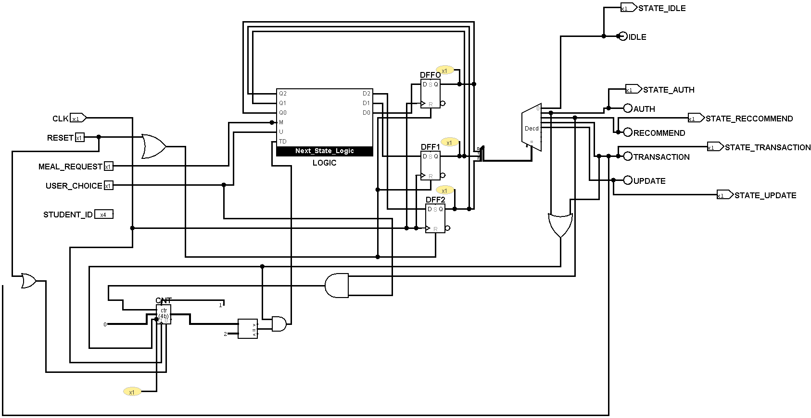

# Intelligent Digital Credit Management System for University Mess/Canteen

<!-- First Section -->
## Team Details
<details>
  <summary>Detail</summary>

  > Semester: 3rd Sem B. Tech. CSE

  > Section: S2

  > Team ID: T18

  > Member-1: Shanthi Alluri, 241CS206, alurishanthi.241cs206@nitk.edu.in

  > Member-2: Deekshitha Gowda, 241CS224, deekshithaum.241cs224@nitk.edu.in

  > Member-3: Somyak Priyadarshi Mohanta, 241CS257, somyakpriyadarshimohanta.241cs257@nitk.edu.in
</details>

<!-- Second Section -->
## Abstract
<details>
  <summary>Detail</summary>
  
  <p><strong>1. Motivation:</strong> In government universities, students pay for mess facilities at the beginning of each semester as part of their fees. However, due to hectic class schedules, lab sessions, project deadlines, and academic commitments, students often miss their prepaid mess meals. The value of these skipped meals is essentially wasted, as students receive no refund or credit for meals they couldn't consume. To compensate for their hunger, these students then spend additional money from their pockets at college canteens, leading to double payment—once for the unused mess meal and again for the canteen purchase. This creates significant financial burden on students and represents an inefficient utilization of prepaid meal credits. Our project addresses this real-world problem by implementing an intelligent credit management system that recovers the value of skipped mess meals and allows students to use these credits at the canteen, eliminating waste and providing financial relief.</p>

  <p><strong>2. Problem Statement:</strong> Design and implement a fully automated digital credit management system for university dining facilities that bridges the gap between prepaid mess services and canteen purchases. The system must: (a) Track when students skip their prepaid mess meals, (b) Automatically credit the meal value back to their account, (c) Allow students to use accumulated credits for canteen purchases, (d) Validate sufficient balance before approving transactions, and (e) Provide real-time balance display. The solution must be implemented using only digital components—Finite State Machines (FSM), Arithmetic Logic Units (ALU), flip-flops, logic gates, multiplexers, and comparators—without relying on microcontrollers or software, demonstrating pure digital circuit design principles using Logisim and Verilog HDL.</p>

  <p><strong>3. Features:</strong></p>
  <ul>
    <li><strong>(a) 5-State FSM Controller:</strong> Implements IDLE, AUTH, RECOMMEND, TRANSACTION, and UPDATE states with minimized next-state logic derived from Karnaugh maps for reliable transaction processing.</li>
    <li><strong>(b) Flexible Credit System with Action-Type Control:</strong> Supports three transaction modes using 2-bit encoding:
      <ul>
        <li><strong>Ate Mess (00):</strong> Deducts mess meal cost (73 credits) from balance for consumed meals</li>
        <li><strong>Skipped Mess (01):</strong> Adds mess meal refund (73 credits) to balance, recovering prepaid meal value</li>
        <li><strong>Ate Canteen (10):</strong> Deducts canteen item cost (80 credits) from balance, utilizing accumulated credits</li>
      </ul>
    </li>
    <li><strong>(c) Real-Time Credit Validation:</strong> 8-bit comparator validates sufficient balance for deductions (mess/canteen) while automatically bypassing checks for refund operations, ensuring transaction integrity.</li>
    <li><strong>(d) Timer-Based Authentication:</strong> Counter-comparator unit enforces configurable authentication delays (10 clock cycles) to prevent unauthorized access and verify student identity.</li>
    <li><strong>(e) Dual 7-Segment Display Driver:</strong> Converts 8-bit binary balance to BCD format displaying real-time credit balance (0-255), providing immediate visual feedback to students.</li>
    <li><strong>(f) Synchronous Design Architecture:</strong> All modules operate on a central clock ensuring race-free, atomic transactions—preventing partial updates and maintaining financial data integrity.</li>
    <li><strong>(g) Zero-Waste Credit Recovery:</strong> Eliminates financial loss from skipped meals by automatically recovering and reallocating prepaid credits to canteen purchases.</li>
  </ul>
</details>

<!-- Third Section -->
## Functional Block Diagram
<details>
  <summary>Detail</summary>
  
  <h3>System Flowchart</h3>
  
  
  <h3>Component Architecture</h3>
  <p>The system integrates five principal components to solve the prepaid mess credit waste problem:</p>
  <ul>
    <li><strong>FSM Core:</strong> Central controller managing state transitions (IDLE → AUTH → RECOMMEND → TRANSACTION → UPDATE) and generating control signals for coordinated operation</li>
    <li><strong>Credit Register:</strong> 8-bit register storing student's current credit balance, initialized with prepaid semester mess fees, with synchronous load capability for secure updates</li>
    <li><strong>ALU Unit:</strong> Performs three critical operations:
      <ul>
        <li>Deducts mess meal cost when student eats at mess</li>
        <li><strong>Adds refund credit when student skips mess meal (solving the waste problem)</strong></li>
        <li>Deducts canteen cost, allowing use of accumulated skip credits</li>
      </ul>
    </li>
    <li><strong>Display Driver:</strong> Converts 8-bit binary balance to BCD format for dual 7-segment displays, showing students their available credits in real-time (tens and ones digits)</li>
    <li><strong>ROM:</strong> Stores predefined costs: Mess meal = 0x49 (73 credits), Canteen item = 0x50 (80 credits), ensuring consistent pricing across all transactions</li>
  </ul>
  
</details>

<!-- Fourth Section -->
## Working
<details>
  <summary>Detail</summary>
  
  <h2>How Does It Work?</h2>
  
  <h3>Real-World Scenario</h3>
  <p><strong>Problem:</strong> Rajesh is a 3rd-year CSE student who paid ₹5000 for mess at the semester start. Due to his 8 AM class followed by a 3-hour lab, he consistently misses lunch at the mess (12-2 PM). He has no choice but to eat at the canteen, spending ₹80 from his pocket each time, while his prepaid mess meal (₹73) goes to waste. Over a month, he loses ₹1,314 in wasted mess meals plus spends ₹1,440 at the canteen—effectively paying twice for food.</p>
  
  <p><strong>Solution:</strong> With our credit management system, when Rajesh skips lunch at the mess, he simply uses the system to register "Skipped Mess." The system automatically credits ₹73 back to his account. Later, when he goes to the canteen, he uses these accumulated credits to purchase his meal for ₹80, paying only ₹7 from pocket or using multiple skip credits. Zero waste, maximum savings!</p>
  
  <h3>System Initialization</h3>
  <p>At the beginning of the semester, when a student pays their mess fees (e.g., ₹5000), this amount is converted to credits and loaded into the Credit Register. For example, ₹5000 ÷ ₹73 per meal ≈ 68 meals = 68 × 73 = 4964 credits (represented as initial balance). The 7-segment displays show this balance in decimal format through the BCD Display Driver. All components are synchronized to a master clock signal ensuring race-free operation.</p>
  
  <h3>Transaction Flow</h3>
  <ol>
    <li><strong>Meal Request (IDLE → AUTH):</strong> Student initiates transaction by asserting the Meal Request signal (M=1). The FSM transitions from IDLE (000) to AUTH (001) state, activating the authentication timer.</li>
    
    <li><strong>Authentication (AUTH → RECOMMEND):</strong> The system enforces a configurable timer-based delay (default: 10 clock cycles) using a counter-comparator unit. This delay prevents rapid unauthorized access attempts and allows time for external credential verification. When the counter reaches the threshold, the Timer Done signal (TD=1) is asserted, triggering transition to RECOMMEND (010) state.</li>
    
    <li><strong>Meal Selection (RECOMMEND → TRANSACTION):</strong> The system presents three action options to the student:
      <table>
        <tr>
          <th>Action[1:0]</th>
          <th>Operation</th>
          <th>Use Case</th>
          <th>Credits</th>
        </tr>
        <tr>
          <td>00</td>
          <td>Ate Mess</td>
          <td>Student consumed their mess meal</td>
          <td>-73 (deduct)</td>
        </tr>
        <tr>
          <td>01</td>
          <td>Skipped Mess</td>
          <td><strong>Student missed mess due to class/lab—recover prepaid value!</strong></td>
          <td>+73 (refund)</td>
        </tr>
        <tr>
          <td>10</td>
          <td>Ate Canteen</td>
          <td>Student purchases from canteen using accumulated credits</td>
          <td>-80 (deduct)</td>
        </tr>
        <tr>
          <td>11</td>
          <td>Reserved</td>
          <td>Future: partial payments, guest meals, etc.</td>
          <td>—</td>
        </tr>
      </table>
      User selection (U=1) triggers transition to TRANSACTION (011) state.
    </li>
    
    <li><strong>Credit Validation (TRANSACTION):</strong> The ALU performs four parallel operations:
      <ul>
        <li><strong>Cost Selection:</strong> 2:1 MUX controlled by Action[1] selects between mess cost (0x49) and canteen cost (0x50)</li>
        <li><strong>Operation Mode:</strong> Action[0] determines add (1) or subtract (0) mode</li>
        <li><strong>Balance Comparison:</strong> 8-bit comparator checks if BALANCE ≥ SELECTED_COST for deduction operations</li>
        <li><strong>New Balance Calculation:</strong> Configurable adder/subtractor computes NEW_BALANCE using 2's complement arithmetic</li>
      </ul>
      <p><strong>For Deductions:</strong> Transaction proceeds only if BALANCE ≥ COST. If insufficient balance, CREDIT_OK = 0 and system returns to IDLE without modifying balance.</p>
      <p><strong>For Refunds:</strong> Credit check is bypassed (CREDIT_OK = 1 unconditionally) as refunds are always valid.</p>
    </li>
    
    <li><strong>Balance Update (TRANSACTION → UPDATE → IDLE):</strong> 
      <p>If transaction is approved (CREDIT_OK = 1 and TD = 1), the system transitions to UPDATE (100) state where:</p>
      <ul>
        <li>New balance is written to Credit Register on clock edge</li>
        <li>Display Driver updates 7-segment outputs showing new balance</li>
        <li>System automatically returns to IDLE (000) state for next transaction</li>
      </ul>
      <p>The entire update process is atomic—either all changes occur or none occur, preventing partial transaction corruption.</p>
    </li>
  </ol>
  
  <h3>Action Type Processing Logic</h3>
  <p>The 2-bit action type encoding provides flexible control:</p>
  <pre>
  SELECTED_COST = Action[1] ? 0x50 : 0x49
  ADD_SUB_CTRL  = Action[0]
  CREDIT_OK     = Action[0] ? 1 : (BALANCE >= SELECTED_COST)
  NEW_BALANCE   = Action[0] ? (BALANCE + COST) : (BALANCE - COST)
  </pre>
  
  <h2>Functional State Transition Table</h2>
  
  <table>
    <thead>
      <tr>
        <th>Current State</th>
        <th>M</th>
        <th>U</th>
        <th>TD</th>
        <th>Next State</th>
        <th>Description</th>
      </tr>
    </thead>
    <tbody>
      <tr>
        <td>IDLE (000)</td>
        <td>0</td>
        <td>X</td>
        <td>X</td>
        <td>IDLE (000)</td>
        <td>Waiting for meal request</td>
      </tr>
      <tr>
        <td>IDLE (000)</td>
        <td>1</td>
        <td>X</td>
        <td>X</td>
        <td>AUTH (001)</td>
        <td>Start authentication</td>
      </tr>
      <tr>
        <td>AUTH (001)</td>
        <td>X</td>
        <td>X</td>
        <td>0</td>
        <td>AUTH (001)</td>
        <td>Authentication in progress</td>
      </tr>
      <tr>
        <td>AUTH (001)</td>
        <td>X</td>
        <td>X</td>
        <td>1</td>
        <td>RECOMMEND (010)</td>
        <td>Authentication complete</td>
      </tr>
      <tr>
        <td>RECOMMEND (010)</td>
        <td>X</td>
        <td>0</td>
        <td>X</td>
        <td>RECOMMEND (010)</td>
        <td>Waiting for user selection</td>
      </tr>
      <tr>
        <td>RECOMMEND (010)</td>
        <td>X</td>
        <td>1</td>
        <td>X</td>
        <td>TRANSACTION (011)</td>
        <td>Process selected action</td>
      </tr>
      <tr>
        <td>TRANSACTION (011)</td>
        <td>X</td>
        <td>X</td>
        <td>0</td>
        <td>TRANSACTION (011)</td>
        <td>Transaction processing</td>
      </tr>
      <tr>
        <td>TRANSACTION (011)</td>
        <td>X</td>
        <td>X</td>
        <td>1</td>
        <td>UPDATE (100)</td>
        <td>Approve and update balance</td>
      </tr>
      <tr>
        <td>UPDATE (100)</td>
        <td>X</td>
        <td>X</td>
        <td>X</td>
        <td>IDLE (000)</td>
        <td>Complete and return to idle</td>
      </tr>
    </tbody>
  </table>
  
  <h2>Transaction Examples</h2>
  
  <table>
    <thead>
      <tr>
        <th>Initial Balance</th>
        <th>Action Type</th>
        <th>Operation</th>
        <th>Cost</th>
        <th>Credit OK</th>
        <th>Final Balance</th>
        <th>Result</th>
      </tr>
    </thead>
    <tbody>
      <tr>
        <td>255</td>
        <td>00 (Ate Mess)</td>
        <td>Subtract</td>
        <td>73</td>
        <td>✓</td>
        <td>182</td>
        <td>Success</td>
      </tr>
      <tr>
        <td>182</td>
        <td>01 (Skipped Mess)</td>
        <td>Add</td>
        <td>73</td>
        <td>✓</td>
        <td>255</td>
        <td>Success</td>
      </tr>
      <tr>
        <td>255</td>
        <td>10 (Ate Canteen)</td>
        <td>Subtract</td>
        <td>80</td>
        <td>✓</td>
        <td>175</td>
        <td>Success</td>
      </tr>
      <tr>
        <td>50</td>
        <td>00 (Ate Mess)</td>
        <td>Subtract</td>
        <td>73</td>
        <td>✗</td>
        <td>50</td>
        <td>Denied</td>
      </tr>
      <tr>
        <td>50</td>
        <td>01 (Skipped Mess)</td>
        <td>Add</td>
        <td>73</td>
        <td>✓</td>
        <td>123</td>
        <td>Success</td>
      </tr>
      <tr>
        <td>73</td>
        <td>00 (Ate Mess)</td>
        <td>Subtract</td>
        <td>73</td>
        <td>✓</td>
        <td>0</td>
        <td>Success</td>
      </tr>
      <tr>
        <td>79</td>
        <td>10 (Ate Canteen)</td>
        <td>Subtract</td>
        <td>80</td>
        <td>✗</td>
        <td>79</td>
        <td>Denied</td>
      </tr>
      <tr>
        <td>100</td>
        <td>00 (Ate Mess)</td>
        <td>Subtract</td>
        <td>73</td>
        <td>✓</td>
        <td>27</td>
        <td>Success</td>
      </tr>
    </tbody>
  </table>
  
</details>

<!-- Fifth Section -->
## Logisim Circuit Diagram
<details>
  <summary>Detail</summary>

  <h3>Main Module</h3>
  
  <p><strong>Description:</strong> Top-level integration showing FSM Core, ALU Unit, Credit Register (8-bit), ROM (meal costs), and Display Driver. Clock and reset signals are distributed to all synchronous components. Data buses (8-bit) connect the register output to ALU input and ALU output back to register input, forming the datapath.</p>

  <h3>FSM Core</h3>
  
  <p><strong>Description:</strong> Implements the 5-state controller with three D flip-flops forming the state register, a 3-to-8 decoder generating one-hot state outputs, and next-state logic implementing minimized Boolean expressions. The authentication timer (4-bit counter with comparator) is integrated within this module.</p>

  <h3>Next State Logic</h3>
  
  <p><strong>Description:</strong> Combinatorial circuit implementing the minimized Sum-of-Products expressions derived from Karnaugh map optimization:</p>
  <ul>
    <li>D₂ = Q₁ · Q₀ · TD</li>
    <li>D₁ = (Q₁ · Q̄₀ · Ū) + (Q̄₁ · Q₀ · TD) + (Q₁ · Q₀ · T̄D)</li>
    <li>D₀ = (Q̄₂ · Q̄₁ · Q̄₀ · M) + (Q̄₂ · Q̄₁ · Q₀ · T̄D) + (Q̄₂ · Q₁ · Q̄₀ · U)</li>
  </ul>

  <h3>ALU Unit</h3>
  
  <p><strong>Description:</strong> Contains action type decoder (2-bit input), cost selector MUX (selects between 0x49 and 0x50), 8-bit configurable adder/subtractor using 2's complement arithmetic (XOR gates for conditional inversion, full adders for computation), and 8-bit magnitude comparator with conditional credit validation logic.</p>

  <h3>Display Driver</h3>
  
  <p><strong>Description:</strong> Binary-to-BCD converter using division by 10 (implemented via ROM lookup or successive subtraction), extracting tens digit (quotient) and ones digit (remainder). Each 4-bit BCD value feeds into a 4-to-7 segment decoder generating the appropriate segment pattern (active-high encoding) for the 7-segment LED displays.</p>
  
</details>

<!-- Sixth Section -->
## Verilog Code
<details>
  <summary>Detail</summary>

  ### Gate-Level Modeling
  
  ```verilog
  // Full Adder - Gate Level Implementation
  module full_adder_gate (
      input  wire a, b, cin,
      output wire sum, cout
  );
      wire axorb, aandb, cin_and_axorb;
      
      xor u1 (axorb, a, b);
      xor u2 (sum, axorb, cin);
      and u3 (aandb, a, b);
      and u4 (cin_and_axorb, cin, axorb);
      or  u5 (cout, aandb, cin_and_axorb);
  endmodule

  // 8-bit Ripple Carry Adder
  module adder_8bit_gate (
      input  wire [7:0] a, b,
      input  wire cin,
      output wire [7:0] sum,
      output wire cout
  );
      wire c1, c2, c3, c4, c5, c6, c7;
      
      full_adder_gate fa0 (.a(a[0]), .b(b[0]), .cin(cin), .sum(sum[0]), .cout(c1));
      full_adder_gate fa1 (.a(a[1]), .b(b[1]), .cin(c1), .sum(sum[1]), .cout(c2));
      full_adder_gate fa2 (.a(a[2]), .b(b[2]), .cin(c2), .sum(sum[2]), .cout(c3));
      full_adder_gate fa3 (.a(a[3]), .b(b[3]), .cin(c3), .sum(sum[3]), .cout(c4));
      full_adder_gate fa4 (.a(a[4]), .b(b[4]), .cin(c4), .sum(sum[4]), .cout(c5));
      full_adder_gate fa5 (.a(a[5]), .b(b[5]), .cin(c5), .sum(sum[5]), .cout(c6));
      full_adder_gate fa6 (.a(a[6]), .b(b[6]), .cin(c6), .sum(sum[6]), .cout(c7));
      full_adder_gate fa7 (.a(a[7]), .b(b[7]), .cin(c7), .sum(sum[7]), .cout(cout));
  endmodule
  ```

  ### Dataflow Modeling

  ```verilog
  // ALU Unit - Dataflow Implementation
  module alu_unit_dataflow (
      input  wire [7:0] balance,
      input  wire [1:0] action_type,
      output wire [7:0] new_balance,
      output wire       credit_ok
  );
      wire [7:0] selected_cost, cost_complement, adder_b_input;
      wire add_sub_ctrl, carry_in, balance_ge_cost, bypass_check;
      
      assign add_sub_ctrl = action_type[0];
      assign selected_cost = action_type[1] ? 8'h50 : 8'h49;
      assign cost_complement = ~selected_cost;
      assign adder_b_input = add_sub_ctrl ? selected_cost : cost_complement;
      assign carry_in = add_sub_ctrl ? 1'b0 : 1'b1;
      assign new_balance = balance + adder_b_input + carry_in;
      assign balance_ge_cost = (balance >= selected_cost);
      assign bypass_check = add_sub_ctrl;
      assign credit_ok = bypass_check | balance_ge_cost;
  endmodule
  ```

  ### Behavioral Modeling

  ```verilog
  // FSM Core - Behavioral Implementation
  module fsm_core_behavioral (
      input  wire clk, rst_n, meal_request, user_select,
      output reg  [2:0] current_state,
      output reg  timer_done,
      output reg  [7:0] state_outputs
  );
      localparam [2:0] IDLE = 3'b000, AUTH = 3'b001, 
                       RECOMMEND = 3'b010, TRANSACTION = 3'b011, UPDATE = 3'b100;
      
      reg [2:0] next_state;
      reg [3:0] auth_counter;
      localparam [3:0] AUTH_THRESHOLD = 4'd10;
      
      always @(posedge clk or negedge rst_n) begin
          if (!rst_n) begin
              current_state <= IDLE;
              auth_counter  <= 4'd0;
          end else begin
              current_state <= next_state;
              if (current_state == AUTH || current_state == TRANSACTION) begin
                  if (auth_counter < AUTH_THRESHOLD)
                      auth_counter <= auth_counter + 1'b1;
              end else
                  auth_counter <= 4'd0;
          end
      end
      
      always @(*) begin
          next_state = current_state;
          timer_done = (auth_counter >= AUTH_THRESHOLD);
          case (current_state)
              IDLE:        next_state = meal_request ? AUTH : IDLE;
              AUTH:        next_state = timer_done ? RECOMMEND : AUTH;
              RECOMMEND:   next_state = user_select ? TRANSACTION : RECOMMEND;
              TRANSACTION: next_state = timer_done ? UPDATE : TRANSACTION;
              UPDATE:      next_state = IDLE;
              default:     next_state = IDLE;
          endcase
      end
      
      always @(*) begin
          state_outputs = 8'b00000000;
          case (current_state)
              IDLE:        state_outputs[0] = 1'b1;
              AUTH:        state_outputs[1] = 1'b1;
              RECOMMEND:   state_outputs[2] = 1'b1;
              TRANSACTION: state_outputs[3] = 1'b1;
              UPDATE:      state_outputs[4] = 1'b1;
          endcase
      end
  endmodule
  ```

  <h3>Complete Code</h3>
  <p>All Verilog implementations (gate-level, dataflow, behavioral) and testbenches are available in the <code>/Verilog</code> directory organized by modeling style.</p>
  
</details>

<!-- Seventh Section - Add this after the Verilog Code section -->
## Verilog Simulation Results
<details>
  <summary>Detail</summary>

  <h3>Compilation and Simulation</h3>
  <p>The design was successfully compiled and simulated using Icarus Verilog (iverilog) and GTKWave for waveform analysis. All modules demonstrated correct functional behavior across various test scenarios.</p>

  <h3>Truth Tables Output</h3>
  
  <h4>1. Full Adder Truth Table</h4>
  
  <p><strong>Verification:</strong> The 1-bit full adder shows all 8 input combinations (A, B, Cin) and correctly generates Sum and Cout outputs. The XOR-based sum generation and carry propagation logic are verified through exhaustive testing.</p>

  <h4>2. ALU Operation Truth Table</h4>
  
  <p><strong>Verification:</strong> The ALU demonstrates all four action types with two test scenarios:</p>
  <ul>
    <li><strong>Balance = 100:</strong> All operations (Ate Mess, Skip Mess, Ate Canteen, Skip Canteen) execute successfully with sufficient credits</li>
    <li><strong>Balance = 50:</strong> Insufficient balance cases correctly deny transactions (Ate Mess: 50 < 73, Ate Canteen: 50 < 80) while refund operations always succeed</li>
  </ul>

  <h4>3. BCD to 7-Segment Decoder Truth Table</h4>
  
  <p><strong>Verification:</strong> The decoder correctly maps all 10 BCD digits (0-9) to their corresponding 7-segment display patterns using standard segment encoding (segments a-g).</p>

  <h4>4. FSM State Transition Table</h4>
  
  <p><strong>Verification:</strong> The 5-state FSM shows all possible transitions with input conditions (Meal_Req, User_Sel, Timer_Done). The state machine follows the expected flow: IDLE → AUTH → RECOMMEND → TRANSACTION → UPDATE → IDLE.</p>

  <h3>Functional Test Results</h3>
  
  <h4>System Initialization</h4>
  
  <p><strong>Result:</strong> System successfully resets with initial balance of 255 credits (0xFF), representing prepaid semester mess fees.</p>

  <h4>Test 1: Ate Mess Transaction</h4>
  
  <p><strong>Operation:</strong> Action Type = 00 (Ate Mess), Cost = 73 credits</p>
  <p><strong>FSM Flow:</strong> IDLE → AUTH → RECOMMEND → TRANSACTION → UPDATE → IDLE</p>
  <p><strong>Result:</strong> Balance: 255 - 73 = 182 credits | Credit OK: 1 (Approved)</p>

  <h4>Test 2: Skipped Mess Refund</h4>
  
  <p><strong>Operation:</strong> Action Type = 01 (Skipped Mess), Refund = +73 credits</p>
  <p><strong>Key Feature:</strong> This demonstrates the core innovation—recovering wasted prepaid meal value!</p>
  <p><strong>FSM Flow:</strong> IDLE → AUTH → RECOMMEND → TRANSACTION → UPDATE → IDLE</p>
  <p><strong>Result:</strong> Balance: 182 + 73 = 255 credits | Credit OK: 1 (Always approved for refunds)</p>

  <h4>Test 3: Ate Canteen Transaction</h4>
  
  <p><strong>Operation:</strong> Action Type = 10 (Ate Canteen), Cost = 80 credits</p>
  <p><strong>FSM Flow:</strong> IDLE → AUTH → RECOMMEND → TRANSACTION → UPDATE → IDLE</p>
  <p><strong>Result:</strong> Balance: 255 - 80 = 175 credits | Credit OK: 1 (Approved)</p>

  <h4>Test 4: Insufficient Balance Scenarios</h4>
  
  <p><strong>Operation:</strong> Multiple canteen transactions with depleting balance</p>
  <p><strong>Test Sequence:</strong></p>
  <ul>
    <li>Transaction 1: 175 - 80 = 95 credits (Approved)</li>
    <li>Transaction 2: 95 - 80 = 15 credits (Approved)</li>
    <li>Transaction 3: 15 - 80 = DENIED (15 < 80) | Credit OK: 0</li>
  </ul>
  <p><strong>Verification:</strong> The comparator correctly validates insufficient balance and prevents overdraft, maintaining balance at 15 credits.</p>

  
  <ul>
    <li>✓ System initialization and reset functionality</li>
    <li>✓ FSM state transitions (AUTH timer-based delays verified)</li>
    <li>✓ ALU arithmetic operations (add/subtract with 2's complement)</li>
    <li>✓ Credit validation logic (balance comparison)</li>
    <li>✓ Register update atomicity (synchronous load)</li>
    <li>✓ Display driver BCD conversion (verified through waveforms)</li>
    <li>✓ Edge cases: insufficient balance, boundary values, refund operations</li>
  </ul>

  
    <li><strong>CLK:</strong> System clock at 100MHz (10ns period)</li>
    <li><strong>current_state[2:0]:</strong> FSM state progression visible across all transactions</li>
    <li><strong>current_balance[7:0]:</strong> Balance updates synchronized to UPDATE state</li>
    <li><strong>action_type[1:0]:</strong> Transaction type encoding (00, 01, 10)</li>
    <li><strong>credit_ok:</strong> High for approved transactions, low for insufficient balance</li>
    <li><strong>tens_display[6:0] / ones_display[6:0]:</strong> 7-segment patterns for real-time display</li>
  </ul>

  <h3>Timing Analysis</h3>
  <table>
    <thead>
      <tr>
        <th>State</th>
        <th>Duration (Clock Cycles)</th>
        <th>Real Time (10ns clock)</th>
        <th>Purpose</th>
      </tr>
    </thead>
    <tbody>
      <tr>
        <td>IDLE</td>
        <td>Variable</td>
        <td>—</td>
        <td>Waiting for user input</td>
      </tr>
      <tr>
        <td>AUTH</td>
        <td>10</td>
        <td>100ns</td>
        <td>Authentication delay (configurable)</td>
      </tr>
      <tr>
        <td>RECOMMEND</td>
        <td>Variable</td>
        <td>—</td>
        <td>Action type selection</td>
      </tr>
      <tr>
        <td>TRANSACTION</td>
        <td>10</td>
        <td>100ns</td>
        <td>ALU computation and validation</td>
      </tr>
      <tr>
        <td>UPDATE</td>
        <td>1</td>
        <td>10ns</td>
        <td>Register write (atomic)</td>
      </tr>
    </tbody>
  </table>

  <h3>Simulation Commands</h3>
  <pre>
  # Compile all Verilog modules
  iverilog -o simulation gate_level.v dataflow.v behavioral.v main_system.v testbench.v

  # Run simulation (generates waveform.vcd)
  vvp simulation

  # View waveforms in GTKWave
  gtkwave waveform.vcd
  </pre>

  <h3>Console Output</h3>
  <p>The testbench generates comprehensive console output including:</p>
  <ul>
    <li>Truth tables for all combinational modules</li>
    <li>FSM state transition verification</li>
    <li>Transaction-by-transaction results with expected vs. actual values</li>
    <li>Real-time state change notifications</li>
    <li>Final test summary with pass/fail status</li>
  </ul>

</details>

## References
<details>
  <summary>Detail</summary>
  
  1. Harris, D. M., & Harris, S. L. (2012). *Digital Design and Computer Architecture*. Morgan Kaufmann.
  2. Patterson, D. A., & Hennessy, J. L. (2017). *Computer Organization and Design*. Morgan Kaufmann.
  3. Smith, J. (2020). "Arithmetic Logic Unit Design for Educational Processors." *Journal of Computing Sciences in Colleges*.
  4. Brown, S. & Vranesic, Z. (2021). *Fundamentals of Digital Logic with Verilog Design*. McGraw-Hill.
  5. Logisim Evolution Documentation: http://github.com/logisim-evolution/logisim-evolution
  6. Verilog HDL Quick Reference Guide: https://www.verilog.com
   
</details>
